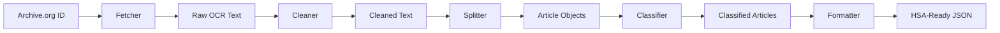

# StoryDredge Documentation

Welcome to the StoryDredge documentation site. StoryDredge is a streamlined pipeline for processing historical newspaper OCR using local LLMs.

## What is StoryDredge?

StoryDredge processes newspaper issues from archive.org and extracts structured news articles for integration with the Human Story Atlas (HSA). It uses a modular pipeline architecture with local LLM-based classification for improved efficiency and scalability.

## Key Features

- **Archive.org Integration**: Download and cache newspaper OCR text
- **OCR Cleaning**: Normalize and fix common OCR errors
- **Article Extraction**: Identify and extract individual articles
- **Local LLM Classification**: Use local Llama models for classification
- **HSA-Ready Output**: Generate properly formatted JSON for Human Story Atlas
- **Parallel Processing**: Process multiple newspaper issues simultaneously
- **Performance Optimization**: Benchmarking and optimization tools

## Pipeline Overview

StoryDredge processes newspapers through a series of stages:

## Getting Started

- [User Guide](user_guide.md) - Comprehensive guide to using StoryDredge
- [Architecture Overview](architecture.md) - Learn about the system design
- [Development Setup](development/setup.md) - Set up your development environment
- [Contributing Guide](development/contributing.md) - How to contribute to the project

## Components

- [Fetcher](components/fetcher.md) - ✅ Download and cache newspaper OCR (Completed)
- [Cleaner](components/cleaner.md) - ✅ Clean and normalize OCR text (Completed)
- [Splitter](components/splitter.md) - ✅ Identify and extract articles (Completed)
- [Classifier](components/classifier.md) - ✅ Classify articles with local LLM (Completed)
- [Formatter](components/formatter.md) - ✅ Format for Human Story Atlas (Completed)
- [Performance](components/performance.md) - ✅ Optimization and parallel processing (Completed)

See the [Components Index](components/index.md) for detailed information about each component.

## API Reference

The StoryDredge API is fully documented to help developers integrate with or extend the pipeline:

- [API Overview](api/overview.md) - Introduction to the StoryDredge API
- [Component APIs](api/fetcher.md) - Detailed API documentation for each component

## Version 1.0 Release

Version 1.0 of StoryDredge is now complete, with all planned milestones implemented and tested:

- ✅ Milestone 1: Project Setup
- ✅ Milestone 2: Utilities and Common Code
- ✅ Milestone 3: Data Acquisition
- ✅ Milestone 4: OCR Cleaning
- ✅ Milestone 5: Article Splitting
- ✅ Milestone 6: Local LLM Integration
- ✅ Milestone 7: HSA Formatting
- ✅ Milestone 8: Pipeline Orchestration
- ✅ Milestone 9: Performance Optimization
- ✅ Milestone 10: Documentation and Final Testing

The [ROADMAP](ROADMAP.md) provides details on all completed milestones and future plans. 